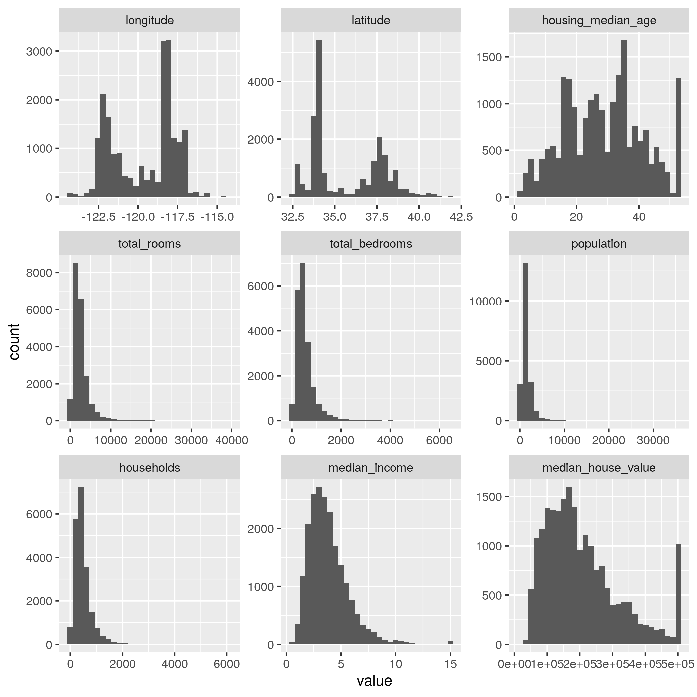

```{.bash .cb.run}
URL="https://raw.githubusercontent.com/ageron/handson-ml2/master/datasets/housing/housing.csv"
mkdir -p _datasets 
curl -so - "$URL" > _datasets/housing.csv
```

```{.R .cb.run hide=stdout+stderr}
library(tidyverse)
```

```{.R .cb.run hide=stdout+stderr}
housing <- read.csv("_datasets/housing.csv") %>% as_tibble
housing_long <- gather(housing, what, value, longitude:median_house_value, factor_key=T)
ggplot(housing_long %>% filter(!is.na(value))) +
  geom_histogram(aes(x=value), bins=30) +
  facet_wrap(~what, scales='free')
ggsave("assets/housing_overview.png")
```

{width=80%}
